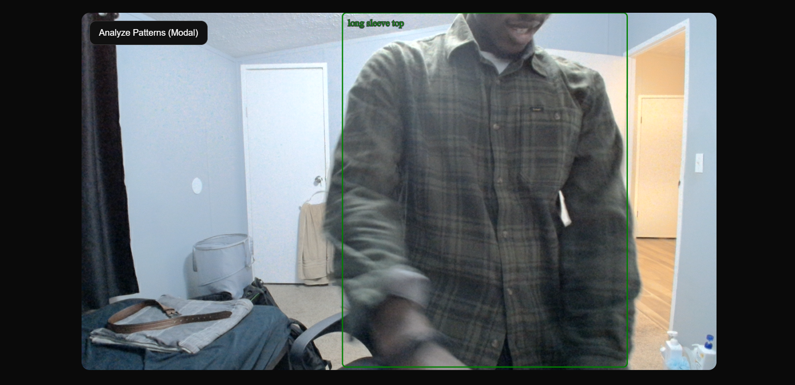
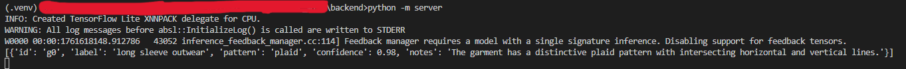
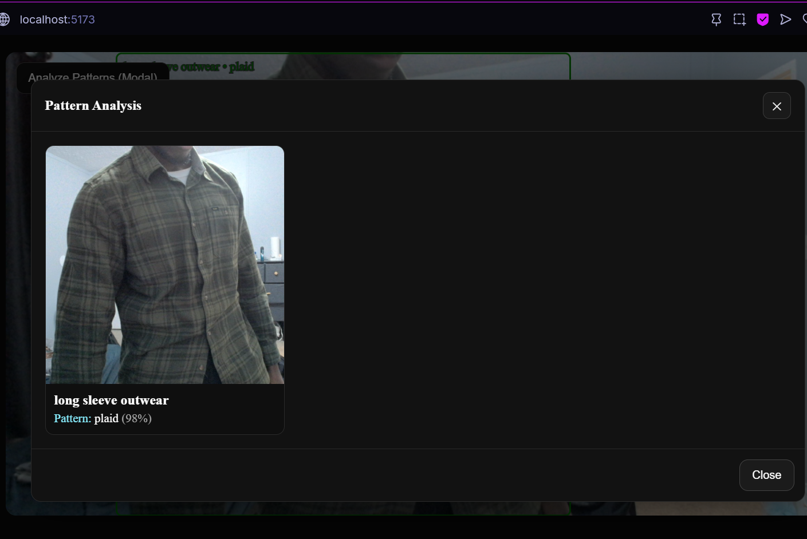

# 👗 WearWise — AI-Powered Mirror for Outfit Analysis

**Author:** Onyekachi Ibekwe  
**Advisor:** Dr. Yu Zhang  
**Institution:** Fisk University  
**Course:** Junior Seminar Project  
**Repo:** [WearWise (opencv-to-flask)](https://github.com/riot662006/wear_wise/tree/opencv-to-flask)

---

## 🩵 Overview

**WearWise** is an intelligent clothing analysis system that segments clothing items from live camera input, identifies their patterns and colors, and generates **quantifiable style scores** (0-100) based on six interpretable fashion principles.

The project integrates **computer vision (YOLO + MediaPipe)** for real-time segmentation, **language models (ChatGPT API)** for pattern reasoning, and **rule-based algorithms** for style scoring.  
WearWise acts as a *smart mirror assistant* that helps users understand and refine their outfits with explainable, data-driven insights.

---

## ⚙️ Tech Stack

### 🖥️ Frontend
- **React + TypeScript**
- Real-time video streaming with `Socket.IO`
- Dynamic overlay using SVG
- Modal-based garment detail viewer (pattern + confidence)

### 🧩 Backend
- **Flask (Python)** 
- **YOLOv8** for clothing segmentation  
- **MediaPipe SelfieSegmentation** for background blur  
- **OpenAI GPT-4o API** for structured pattern classification  
- **Socket.IO server** for real-time video frames  
- **Style Scoring System** - Rule-based algorithms for quantifiable style scores
- **REST API** for style scoring endpoints
- Modularized architecture for easy extension

### 🧠 AI Models & Algorithms
- **Segmentation:** YOLOv8 (custom weights fine-tuned on DeepFashion2)
- **Pattern Recognition:** ChatGPT-4o Structured Outputs (JSON Schema)
- **Style Scoring:** Six interpretable algorithms (Color Harmony, Pattern Balance, Texture Mix, Highlight Principle, Proportion, Repetition)
- **Color Distance:** CIEDE2000 implementation for accurate color comparison

---

## 🧩 Features

### ✅ Real-Time Garment Segmentation
Detects and classifies clothing items (shirts, pants, shorts, etc.) using YOLOv8, returning bounding boxes and labels.

### ✅ Background Blur Preprocessing
Uses MediaPipe to isolate the subject and blur the background — improving model focus and visual clarity.

### ✅ AI-Driven Pattern Recognition
Crops each detected garment and sends it to GPT-4o for pattern identification (e.g., *striped*, *floral*, *graphic*).

### ✅ React Live Interface
Streams live webcam feed with overlayed bounding boxes and garment labels.
Provides "Analyze Patterns" button to pause the video and display pattern analysis results in a modal.
Includes "Score Style" button to get quantifiable style scores with explanations.

### ✅ Style Scoring System (v0.1)
Computes 0-100 style scores based on six interpretable factors:
- **Color Harmony** - 50/30/20 color pyramid and hue harmony via CIEDE2000
- **Pattern Balance** - Rule of One for patterns (one strong pattern = optimal)
- **Texture Mix** - Material variety (2-3 ideal) with gloss contrast bonus
- **Highlight Principle** - Rule of One across four domains
- **Proportion** - 33/66 visual ratio with optional waist/neck echo
- **Repetition** - Color echo between accent and accessories

Provides explainable insights and subscores for each factor.

### ✅ Modular Flask API
Endpoints:
- **Socket.IO Events:**
  - `frame`: Receives video frames for real-time segmentation
  - `analyze_patterns`: Sends cropped garments for pattern recognition
- **REST API:**
  - `POST /api/style/score`: Scores an outfit and returns style score with explanations

### 🔜 Coming Soon
- **Real Feature Extraction:** Color clustering, person segmentation, domain z-scores
- **Outfit Recommendation Engine:** Suggests changes or matching items for balance and contrast  
- **User History / Style Log:** Keeps records of previous outfits for reflection and tracking improvement
- **Personalization:** User-specific style preferences and weight tuning
- **Seasonal Appropriateness:** Context-aware scoring based on weather and occasion

---

## 🧭 Project Structure

```bash
wear_wise/
│
├── backend/
│ ├── server.py              # Flask entry point (Socket.IO + REST API)
│ ├── config/
│ │ ├── defaults.py          # Configuration defaults
│ │ └── scores-0.1.0.json    # Style scoring configuration
│ ├── detection/
│ │ └── yolo_detector.py     # YOLOv8 clothing detector
│ ├── preprocess/
│ │ ├── bg_blur.py           # MediaPipe background blur
│ │ └── utils.py             # Image processing utilities
│ ├── services/
│ │ ├── ai_client.py         # OpenAI GPT-4o API client
│ │ └── ai_schemas.py        # Pattern analysis schemas
│ ├── scoring/               # Style scoring system
│ │ ├── __init__.py          # Module exports
│ │ ├── scorer.py            # Main scoring algorithms (6 subscores)
│ │ ├── color_distance.py    # CIEDE2000 color distance
│ │ ├── config.py            # Configuration loader
│ │ ├── types.py             # Type definitions
│ │ ├── example.py           # Usage example
│ │ └── README.md            # Scoring system documentation
│ ├── tests/
│ │ ├── __init__.py
│ │ └── test_scoring.py      # Unit and integration tests
│ └── models/
│     └── yolov8n.pt         # YOLOv8 model weights
│
├── frontend/
│ ├── src/
│ │ ├── App.tsx              # Main React component
│ │ ├── api/
│ │ │ └── styleScore.ts      # Style scoring API client
│ │ ├── components/
│ │ │ ├── BoundingBoxOverlay.tsx  # SVG overlays for detections
│ │ │ ├── ConnectionOverlay.tsx   # Connection status indicator
│ │ │ ├── Modal.tsx               # Base modal component
│ │ │ ├── PatternModal.tsx        # Pattern analysis modal
│ │ │ └── StyleScoreModal.tsx     # Style score display modal
│ │ ├── hooks/
│ │ │ └── useSocket.ts       # Socket.IO hook
│ │ ├── types/
│ │ │ ├── socket.d.ts        # Socket.IO type definitions
│ │ │ └── styleScore.ts      # Style scoring type definitions
│ │ └── utils/
│ │     └── outfitFeatures.ts # Data transformation utilities
│ ├── package.json
│ └── vite.config.ts
│
├── examples/                # Sample output images
├── experiments/             # Experimental notebooks and scripts
├── datasets/                # Training datasets
├── run_all.py              # Script to run backend + frontend
├── requirements.txt        # Python dependencies
└── README.md               # This file
```

---

## 🧰 Setup Instructions

### Prerequisites
- Python 3.8+ 
- Node.js 16+ and npm
- Webcam access
- OpenAI API key (for pattern recognition)

### 1. Clone Repository
```bash
git clone https://github.com/riot662006/wear_wise.git
cd wear_wise
git checkout opencv-to-flask  # or your working branch
```

### 2. Backend Setup
```bash
# Create virtual environment
cd backend
python -m venv .venv

# Activate virtual environment
# On Windows:
.venv\Scripts\activate
# On macOS/Linux:
source .venv/bin/activate

# Install dependencies
pip install -r ../requirements.txt
```

### 3. Frontend Setup
```bash
# Install Node.js dependencies
cd frontend
npm install
```

### 4. Environment Variables
Create a `.env` file in the `backend/` directory (or set environment variables):
```ini
OPENAI_API_KEY=your_openai_api_key_here
WEARWISE_VLM=gpt-4o-mini  # Optional: specify OpenAI model
```

The backend will use default paths for models:
- `MODEL_PATH=backend/models/yolov8n.pt`
- `DEVICE=cpu` (or `cuda` if available)

### 5. Run the System

#### Option A: Run Both Services Together (Recommended)
```bash
# From project root
python run_all.py
```

#### Option B: Run Services Separately

**Terminal 1 - Backend:**
```bash
cd backend
python server.py
# Backend runs on http://localhost:5000
```

**Terminal 2 - Frontend:**
```bash
cd frontend
npm run dev
# Frontend runs on http://localhost:5173
```

### 6. Access the Application
- Open your browser and visit: **http://localhost:5173**
- Allow webcam access when prompted
- Wait for connection status to show "connected"
- Click "Analyze Patterns" to detect clothing patterns
- Click "Score Style" to get style scores (after pattern analysis)

### 7. Testing the Style Scoring System
```bash
# Run unit tests
cd backend
python -m pytest tests/test_scoring.py -v

# Run example script
python -m scoring.example
```

### 📸 Sample Output
Step | Description | Example
-- | -- | --
Segmentation | Garments outlined and labeled | 
Pattern Detection | GPT-4o returns pattern + confidence | 
Pattern Modal | Crops and results shown interactively | 
Style Score | Quantifiable score with subscores and explanations | See Style Scoring section below

## 🎯 Style Scoring System

### How It Works
The style scoring system evaluates outfits based on six interpretable fashion principles:

1. **Color Harmony (25% weight)** - Measures how close the color distribution is to the ideal 50/30/20 pyramid and evaluates hue harmony using CIEDE2000 color distance
2. **Pattern Balance (15% weight)** - Implements the Rule of One: one strong pattern is optimal, multiple competing patterns reduce the score
3. **Texture Mix (10% weight)** - Rewards 2-3 unique materials with a bonus for single glossy piece (gloss contrast)
4. **Highlight Principle (20% weight)** - Ensures one clear focal point across four domains: skin exposure, hue saturation, texture variance, pattern presence
5. **Proportion (20% weight)** - Evaluates the 33/66 visual ratio (top/bottom balance) with optional waist/neck echo
6. **Repetition (10% weight)** - Rewards color echo between accent colors and accessories

### API Usage

**Endpoint:** `POST /api/style/score`

**Request:**
```json
{
  "outfitId": "outfit-123",
  "garments": [
    {
      "id": "top1",
      "type": "top",
      "areaPct": 0.31,
      "colorLAB": [62, -4, -8],
      "material": "cotton",
      "patternType": "plaid",
      "patternStrength": 0.72,
      "glossIndex": 0.1
    }
  ],
  "colorClusters": [
    {"lab": [60, -5, -7], "pct": 0.52},
    {"lab": [48, 2, 4], "pct": 0.30},
    {"lab": [70, -6, -10], "pct": 0.18}
  ],
  "thirdsArea": {"top": 0.35, "mid": 0.30, "bottom": 0.35},
  "domainZ": {"skin": 0.2, "hue": 1.4, "texture": 0.5, "pattern": 0.1},
  "extractionVersion": "segm-1.2.0-kmeans-3"
}
```

**Response:**
```json
{
  "version": "scores-0.1.0",
  "styleScore": 82.6,
  "subscores": {
    "colorHarmony": 0.84,
    "patternBalance": 1.0,
    "textureMix": 0.80,
    "highlightPrinciple": 0.95,
    "proportion": 0.65,
    "repetition": 0.90
  },
  "explanations": [
    "Color harmony is strong (close to 50/30/20).",
    "Single hero pattern detected; others kept calm.",
    "Clear focal point following the Rule of One."
  ],
  "debug": {...}
}
```

### Configuration
Style scoring configuration is stored in `backend/config/scores-0.1.0.json`. You can adjust:
- Weight distribution across subscores
- Color harmony thresholds (dMin, dMax, tauH)
- Pattern strength thresholds (strong, mild)
- Proportion ideal ratios and tolerance
- Highlight principle z-score thresholds

See `backend/scoring/README.md` for detailed documentation.

---

## 🧪 Testing

### Backend Tests
```bash
cd backend
python -m pytest tests/test_scoring.py -v
```

### Style Scoring Example
```bash
cd backend
python -m scoring.example
```

### Manual Testing
1. Start the application (see Setup Instructions)
2. Allow webcam access
3. Click "Analyze Patterns" and wait for results
4. Click "Score Style" to see the style score modal
5. Review subscores and explanations

## 🗺️ Future Roadmap

### Short Term (v0.2)
- ✅ **Style Scoring System** - Completed in v0.1
- 🔄 **Real Feature Extraction** - Replace mock data with:
  - Color clustering (k-means on LAB colors from clothing regions)
  - Person segmentation for thirds area calculation
  - Domain z-score calculation from extracted features
  - Material classification from images or metadata
  - Pattern strength estimation from CNN/heuristics
- **Performance Optimization** - Batch processing, caching, GPU acceleration

### Medium Term (v0.3)
- **Outfit Recommendation Engine** - Suggest changes or matching items
- **User History / Style Log** - Track outfits over time
- **Personalization** - User-specific style preferences and weight tuning
- **A/B Testing Framework** - Compare scoring algorithm versions
- **Export Functionality** - Save outfit scores and recommendations

### Long Term (v1.0+)
- **Seasonal Appropriateness** - Context-aware scoring (weather, occasion)
- **Multi-Image Analysis** - Front/side/back views for better accuracy
- **Machine Learning Enhancement** - Learn weights from human ratings
- **Social Features** - Share outfits, compare scores with friends
- **Mobile App** - Native iOS/Android applications
- **AR Integration** - Augmented reality outfit visualization

---

## 🔧 Development

### Project Architecture
- **Backend:** Flask with Socket.IO for real-time communication and REST API for style scoring
- **Frontend:** React with TypeScript, Socket.IO client for real-time updates
- **Scoring:** Pure Python algorithms, no ML model dependencies for scoring
- **Pattern Recognition:** OpenAI GPT-4o with structured outputs

### Key Design Decisions
- **Deterministic Scoring:** Same input always produces same output (versioned config)
- **Explainable Results:** All scores include human-readable explanations
- **Modular Architecture:** Easy to extend with new scoring factors
- **Type Safety:** TypeScript on frontend, TypedDict on backend

### Code Style
- Python: Follow PEP 8, use type hints
- TypeScript: Follow React best practices, use strict mode
- Tests: Write unit tests for all algorithms, integration tests for API

### Adding New Features
1. Create feature branch from `main`
2. Implement feature with tests
3. Update documentation
4. Submit pull request with description

## 🤝 Contributing

Contributions and discussions are welcome!
You can fork the repository, create feature branches, and submit pull requests.

### Areas for Contribution
- Feature extraction (color clustering, person segmentation)
- Additional scoring algorithms
- UI/UX improvements
- Documentation
- Testing and bug fixes
- Performance optimization

## 📚 Documentation

- **Main README:** This file
- **Style Scoring:** `backend/scoring/README.md` - Detailed scoring system documentation
- **API Documentation:** See Style Scoring System section above
- **Code Documentation:** Inline comments and docstrings

---

## 🐛 Troubleshooting

### Common Issues

**Backend won't start:**
- Check that Python virtual environment is activated
- Verify all dependencies are installed: `pip install -r requirements.txt`
- Check that port 5000 is not in use

**Frontend won't connect:**
- Ensure backend is running on http://localhost:5000
- Check browser console for errors
- Verify Socket.IO connection in browser dev tools

**Pattern analysis fails:**
- Verify OpenAI API key is set in environment variables
- Check API key has sufficient credits
- Review backend logs for error messages

**Style scoring returns errors:**
- Ensure pattern analysis has completed first
- Check that outfit features are properly formatted
- Review backend logs for detailed error messages

**Webcam not working:**
- Grant browser permissions for camera access
- Check that no other application is using the webcam
- Try a different browser (Chrome, Firefox, Edge)

### Getting Help
- Check existing issues on GitHub
- Review documentation in `backend/scoring/README.md`
- Create a new issue with error details and logs

## 📝 License

MIT License © 2025 Onyekachi Ibekwe

This project was developed as part of the **Fisk University Computer Science Junior Seminar** under the supervision of **Dr. Yu Zhang**.

## 🙏 Acknowledgments

- **YOLOv8** by Ultralytics for clothing segmentation
- **MediaPipe** by Google for selfie segmentation
- **OpenAI** for GPT-4o pattern recognition
- **React** and **Flask** communities for excellent frameworks
- **Dr. Yu Zhang** for guidance and supervision